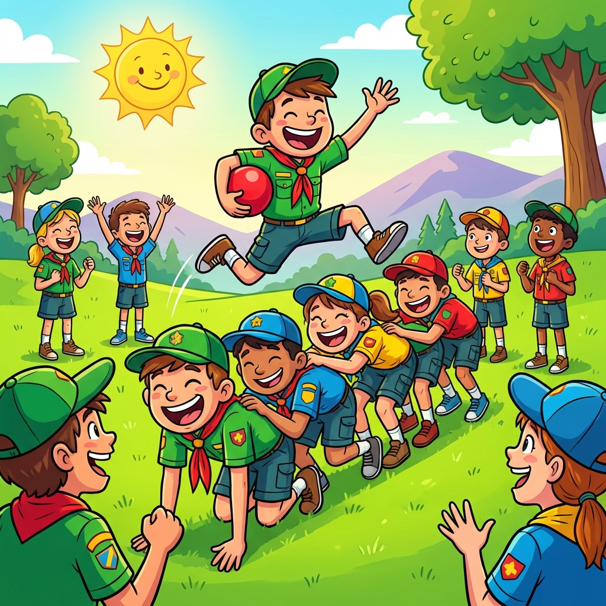

Um desafio físico divertido que obriga a equipa a coordenar-se em três tipos de movimentos diferentes.

## Material Necessário

- 1 bola por equipa

## Imagem do Jogo

## Duração
10 minutos

## Desenvolvimento

A equipa forma em linha reta, orientada lateralmente e de barriga para baixo (como um código de barras). O jogo tem dois momentos entre os pontos A e B:

### Ida (A → B) 
1. **Túnel + Bowling**: Todos fazem a posição de túnel. O último atira a bola por baixo dos colegas até ao primeiro.
2. **Canguru**: Quando a bola chega ao primeiro, todos deitam-se. O primeiro agarra na bola e salta por cima dos colegas até ao fim da fila.
3. **Repetição**: Chegando ao fim, voltam a fazer túnel e repete-se o processo até a equipa chegar ao ponto B.

### Volta (B → A)
1. **Apenas Túnel**: No regresso, usa-se apenas a posição de túnel.
2. **Deslocação**: O último elemento passa por baixo de todos até ser o primeiro. Repete-se sucessivamente até chegarem ao ponto A.

**Vencedor**: Ganha a equipa que completar o percurso de ida e volta mais rapidamente.
