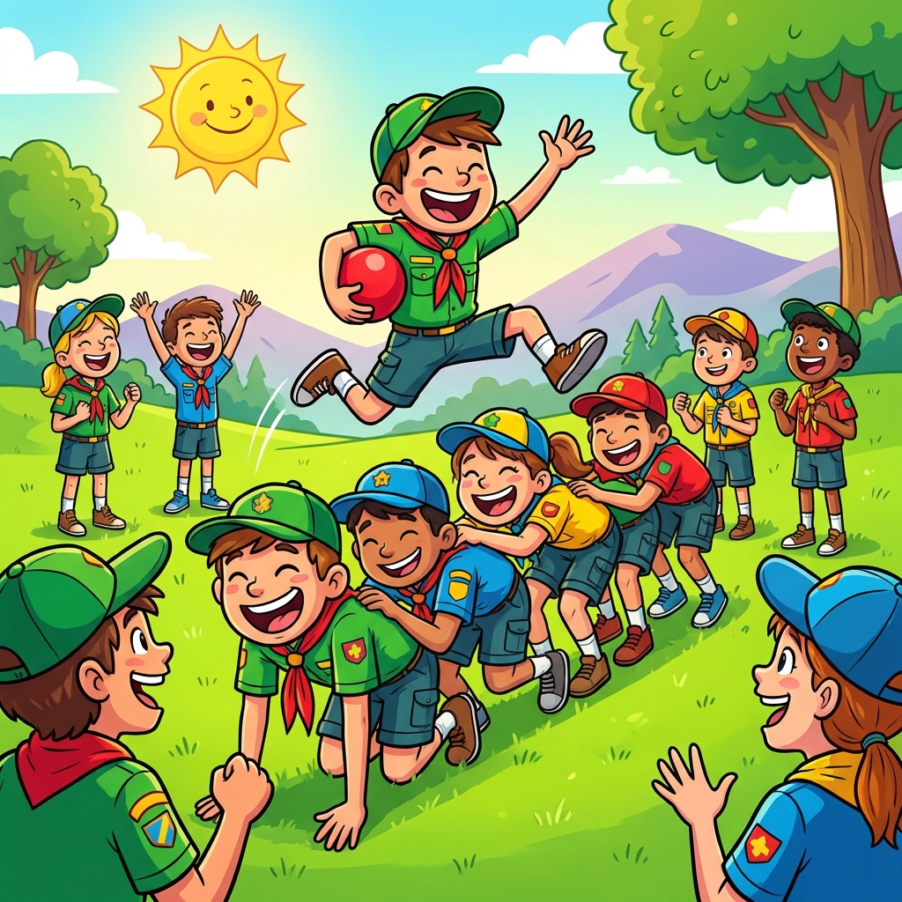


Um desafio físico hilariante que obriga a equipa a coordenar-se em três tipos de movimentos diferentes para vencer esta estafeta maluca!


## 🎯 Objetivo
Completar o percurso de ida e volta o mais rapidamente possível, coordenando três movimentos de equipa complexos: túnel, bowling da bola e salto de canguru sobre a equipa.

## ⏱️ Duração e Participantes
- **Duração:** 10 minutos
- **Participantes:** Ideal para equipas de 5 a 8 elementos.

## 🛠️ Material Necessário
- 1 bola redonda (tamanho basquetebol ou futebol) por equipa

## 📜 Como Jogar

A equipa forma em linha reta, orientada lateralmente e de barriga para baixo (como um código de barras gigante). O formato da corrida consiste na ida para um ponto (A → B) e na volta à base (B → A):

**Ida:**
1. **O Túnel:** Todos fazem a posição de túnel (prancha alta ou quatro apoios largos). O último elemento da fila rola a bola pelo chão, por baixo das pernas dos colegas, até chegar ao primeiro.
2. **O Canguru:** Quando a bola chega ao primeiro, este agarra a bola. Simultaneamente, todos os outros no "túnel" deitam-se rapidamente no chão. O primeiro elemento salta por cima dos testas/pernas dos colegas até chegar ao fim da fila.
3. **Repetição de Padrão:** Chegando ao fim, todos os elementos voltam à posição de túnel, repetindo o passo 1. Movem-se iterativamente até o primeiro elemento da fila ultrapassar a linha de meta "B".

**Volta:**
4. **Deslocação de Toupeira:** No regresso, as regras mudam. Deixa de se usar a bola. Com todos em posição de túnel, o último elemento rasteja por baixo das pernas de todos até ser o primeiro da fila.
5. **Avanço Perpétuo:** Assim que o colega sai na frente, forma novo túnel. O imediatamente "novo" último elemento faz o mesmo.
6. **Vitória:** Vence a equipa cujo último elemento consiga cruzar inteiramente a linha de partida (A).

## 🌟 Dicas de Animação

> [!TIP]
> **Ritmo e Sincronização**
> Encoraja o Guia/Líder de equipa a dar ordens claras em voz alta (ex: "TÚNEL!", "CHÃO!") para que todos se movimentem em uníssono de forma quase militar. A sincronização falhada resulta num "engarrafamento" divertido!

## 🛡️ Segurança

> [!WARNING]
> **Proteção nas Quedas**
> Ao saltar no modo "Canguru", garantir que os participantes deitados estão próximos huns dos outros para saltos justos mas que a cabeça de uns não está em risco de ser pisada por quem salta. O terreno deve ser preferencialmente areia, relva ou pavilhão liso.

## 🔄 Variantes

### Percurso com Obstáculos (Pioneiros)
Em vez de um percurso em linha reta em campo aberto, definir um percurso sinuoso (ziguezague) à volta de troncos/árvores, o que exige alinhamento constante do túnel nas curvas.
