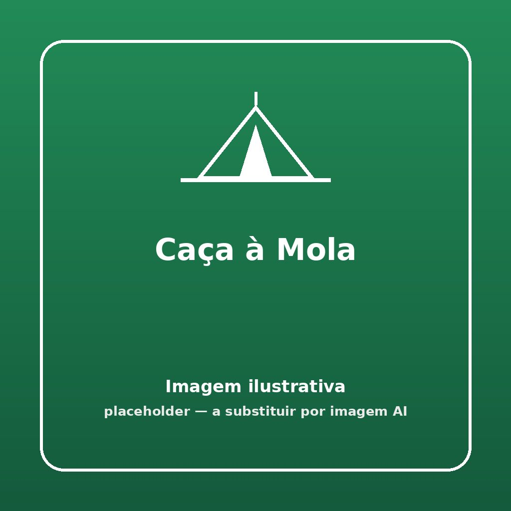


Um combate caótico na arena! Apanha todas as molas das costas dos teus rivais antes que te acabe o azar e fiques sem nenhuma.


## 🎯 Objetivo
Roubar o máximo de molas presas na roupa dos adversários e depositá-las no baú da própria equipa. Se ficares sem molas, ficas temporariamente fora de combate!

## ⏱️ Duração e Participantes
- **Duração:** 10 a 15 minutos (ou até esgotarem as molas do banco)
- **Participantes:** Ideal para 2 a 4 grandes equipas em simultâneo.

## 🛠️ Material Necessário
- Cerca de 25 molas de roupa robustas por equipa
- 1 balde, pote ou caixa (Baú) por equipa
- Fita limitadora ou corda para delimitar e "fechar" a arena (opcional)

## 📜 Como Jogar

1. **Preparação:** Delimitar uma arena vasta de limites claros para a "caça". Posicionar o "baú" de cada equipa num canto diferente.
2. **Equipamentos Iniciais:** O animador distribui uma mola de roupa a cada participante, para estes prenderem algures nas costas (parte superior da camisola). Conserva-se o grosso das molas no banco/animador.
3. **Combate:** Ao sinal do apito, todos entram na arena central e tentam roubar a mola das costas de um adversário.
4. **Recolha:** A mola roubada pode e deve ser logo corrida a ser depositada no balde da equipa correspondente. Podem tentar-se roubar várias na mesma "volta" de arena, mas há o risco de a perder!
5. **Regra de Perda da Mola:** Alguém a quem a mola lhe foi retirada está temporariamente "eliminado" como combatente fantasma. Só consegue voltar ao jogo se sair da arena pela zona do animador para pedir um repor/novo fornecimento de uma mola (se ainda houver stock!).
6. **Vencedor:** O jogo acaba quando todas as molas em reserva num lado acabarem ou o tempo passar. Conta-se os baldes de base de cada equipa. A equipa com maior assalto final recolhido ganha.

## 🌟 Dicas de Animação

> [!TIP]
> **Identidades e Classes**
> Dá o nome de classes à apanha da mola. Um baú é um 'Castelo' e as molas são as respetivas moedas da coroa. Podes limitar o número de moedas transportadas (ex: as mãos têm de estar ambas à vista) para forçar o constante regressar ao baú em risco!

## 🛡️ Segurança

> [!WARNING]
> **Proibido Contacto Violento e Molas Perigosas**.
> O contacto nos agarros não é wrestling corporal, deve ser só um arrancar cirurgico com um puxão da mola na aba de tecido. Sugere-se molas de madeira grandes. Não usar molas pequenas e apertadas plásticas que possam prender nos materiais sintéticos das camisolas e beliscá-los ou rasgá-las.

## 🔄 Variantes

### Jogo do Rei / Bandeira Protegida
Os dirigentes do jogo dão secretamente uma "Mola Dourada" (Cor Diferente) para o elemento a proteger das costas em cada bando/patrulha. Os baús estão ausentes mas quem captura a mola dorada retira do jogo 5 elementos e não podem regressar à partida.
