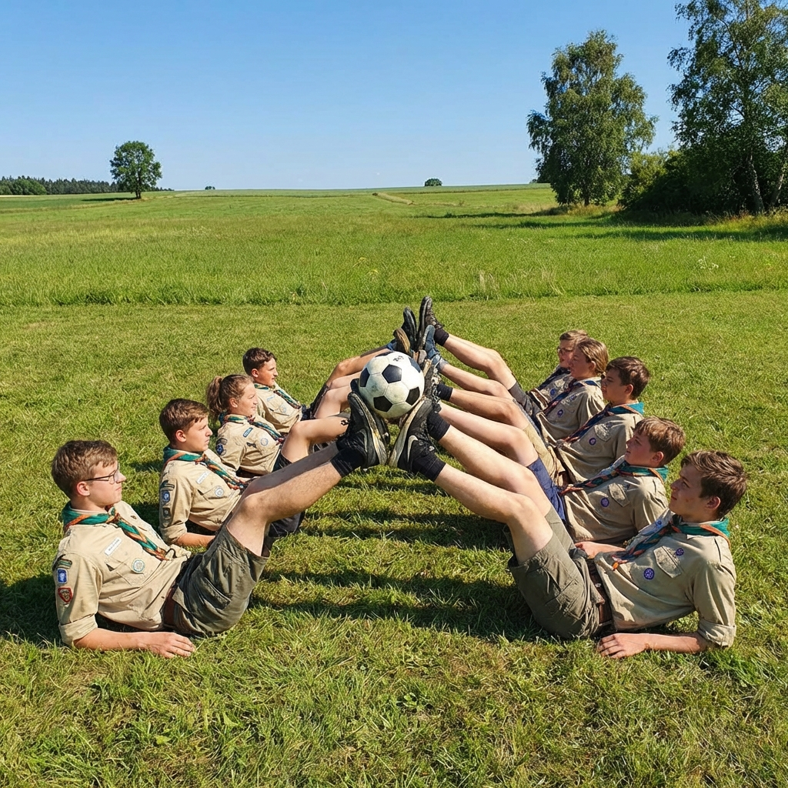

A "Centopeia às Avessas" é um jogo hilariante e desafiante que testa a coordenação de equipa e a agilidade das pernas.

## Material Necessário

* 1 bola (futebol, andebol, etc) por equipa
  * *Nota: quanto mais pequena, maior o nível de dificuldade*

## Duração
7 a 10 minutos

## Desenvolvimento

1. A equipa forma uma linha reta, com todos os elementos deitados de costas.
2. O objetivo é transportar a bola entre dois pontos distantes (A e B), utilizando apenas os pés.
3. O elemento da frente passa a bola para o elemento seguinte com os pés.
4. Os seguintes repetem o movimento até que a bola chegue ao final da fila.
5. À medida que passam a bola, os elementos devem levantar-se e correr para o final da fila para continuar a "centopeia".
6. O jogo termina quando a bola chegar ao ponto final (B).

**Regras:**
- Se a bola cair, deve voltar ao primeiro elemento da cadeia.
- Ganha a equipa que mais rapidamente transportar a bola do ponto A para o ponto B.
