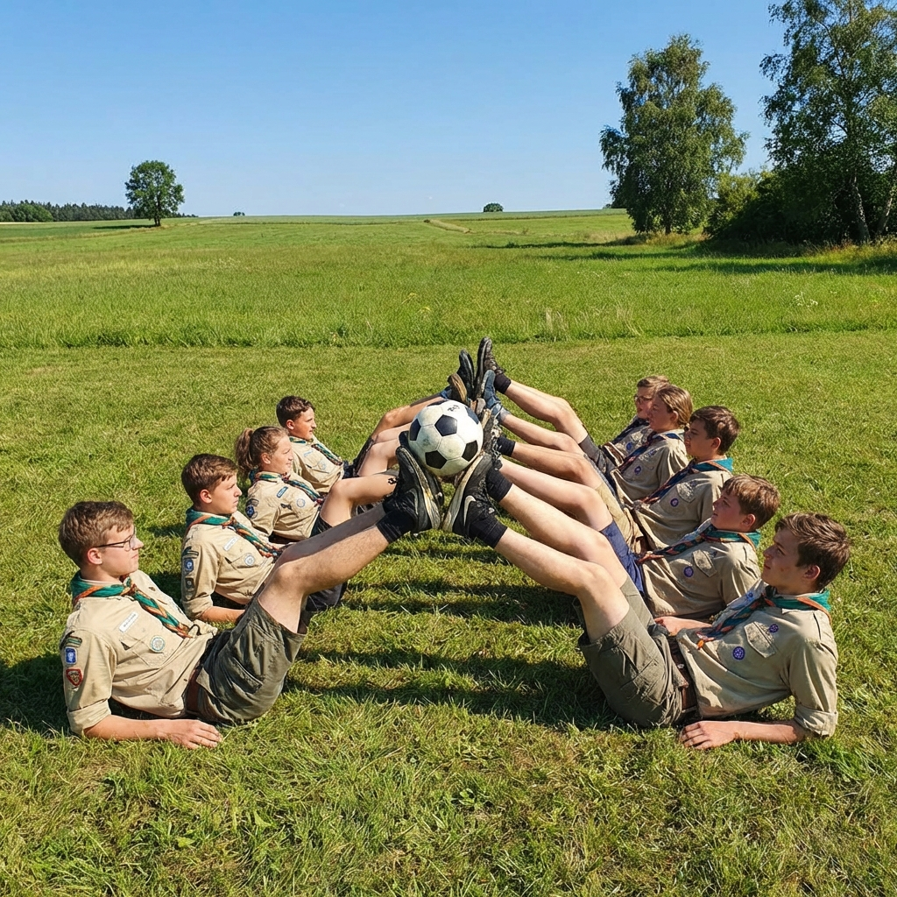


A "Centopeia às Avessas" é um jogo hilariante e fisicamente exigente que testa a coordenação tática e a agilidade das pernas!


## 🎯 Objetivo
Trabalhar em cadeia de montagem reversa: transportar uma bola de uma ponta à outra num percurso longo (A->B), passando-a entre os membros de equipa, usando exclusivamente os pés enquanto estão deitados no chão.

## ⏱️ Duração e Participantes
- **Duração:** 7 a 10 minutos
- **Participantes:** Ideal para equipas de 4 a 6 elementos por via / corredor de corrida.

## 🛠️ Material Necessário
- 1 bola de futebol ou andebol por equipa (bolas menores = maior dificuldade)
- Algo para marcar a linha de partida e do fim (A e B)

## 📜 Como Jogar

1. **Alinhamento da Centopeia:** A equipa forma uma linha reta indiana no ponto de Partida, com todos os elementos deitados de costas no chão, virados de barriga para cima de cabeça pousada, uns atrás dos outros (cabeça quase no calcanhar de quem está atrás).
2. **O Movimento Base:** O líder da centopeia (primeiro da fila) recebe entre a sola dos pés, agarrando como alicates a bola. Passa a bola, elevando as pernas e fletindo o abdómen, largando a bola por cima e para trás da sua cabeça para as pernas elevadas de quem está imediatamente atrás dele.
3. **Passa-Passa:** O elemento que recebeu lá trás passa ao seguinte usando a mesma técnica abdominal com impulsão superior traseira sem deixar cair a bola na relva! Se a bola cair ao repassar de um par para outro, "quebra" a centopeia - recomeça do início ou tem de fazer 5 flexões e retomar daí.
4. **Alimentação da Lagarta:** Á medida que cada um se livra da bola porque a passou para trás com sucesso, levanta-se a correr e vai deitar-se rapidamente a formar lagarta na cauda mais remota da fila para continuar o túnel "às arrecuas".
5. **Vitória:** A lagarta vai andando para trás infinitamente e ciclicamente. Ganha a primeira equipa cuja "cauda final deitado a agarrar a bola no pé", consiga atravessar fisicamente deitado a linha B. 

## 🌟 Dicas de Animação

> [!TIP]
> **Ritmo Fluído**
> A componente-chave além de força perno-abdominal é quão rápido o gajo da frente corre para a rua de trás sem ficar a olhar e esquecer-se de continuar o fluxo do comboio! Podes obrigar os exploradores a descalçar os sapatos e fazer isto de meias molhadas para a piada física acrescida com bolas de plástico liso escorregadias!

## 🛡️ Segurança

> [!WARNING]
> **Impacto Nas Costas**
> Não jogar nunca em asfalto porque as omoplatas ou cabeça caem e batem para trás constantemente no balanço natural. Areia do campo marítimo é perfeito para esta "centopeia" rastejante, bem como relvado de parque e lona sobre manta.

## 🔄 Variantes

### Centopeia Cega Parcial
Quem está lá trás deitado à espera e de mãos ao lado, com as pernas abertas levantadas à espera que a bola dele caia dentro da recepção dos calcanhares, está sempre vendado ou proíbido de destapar visão fechada apertada antes! Obriga o passador da frente a largá-la bem centrado e calculadamente no colo sem brutalidade errada!
