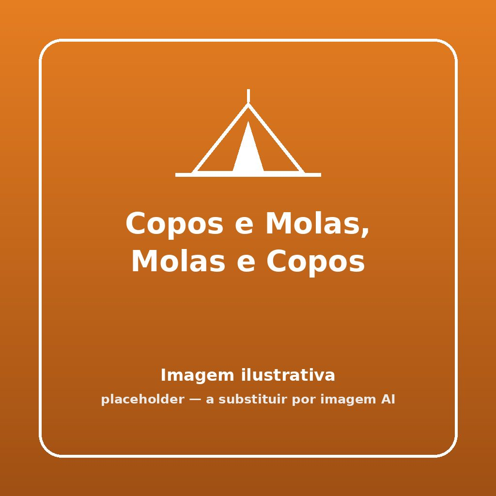


Um verdadeiro teste de motricidade fina, paciência e pulso firme! Quem consegue empilhar todos os copos sem os tocar com as mãos?


## 🎯 Objetivo
Transportar e empilhar, um a um, uma série de copos de plástico no final de um percurso, utilizando Apenas e exclusivamente uma mola de roupa para os agarrar.

## ⏱️ Duração e Participantes
- **Duração:** 10 a 15 minutos
- **Participantes:** Ideal para estafetas de base, equipas de 4 a 6 elementos.

## 🛠️ Material Necessário
- 1 mola de roupa resistente (madeira é melhor) por equipa
- 5 a 10 copos de plástico/papel rijo por equipa
- Mesas de apoio na meta (opcional mas recomendado)

## 📜 Como Jogar

1. **Circuito:** As equipas alinham-se no ponto de partida (A) em formato indiano. No ponto de retorno (B), a uns metros de distância, estão os copos espalhados pela mesa.
2. **A Corrida:** Ao sinal de partida, o primeiro jogador de cada fila corre do ponto A ao ponto B transportando apenas a mola de roupa na mão.
3. **A Apanha:** Chegando à mesa (B), o jogador tem de usar a mola (abrindo-a e fechando-a na aba/orelha do copo) para o agarrar. É proibido usar a outra mão para segurar no copo!
4. **O Castelo:** O jogador deve pousar / assentar esse copo. Regressa a correr, entrega a mola em mão ao parceiro seguinte.
5. **A Empilha:** Todos os jogadores seguintes repetem o processo de correr e apanhar com a mola, mas TÊM de conseguir encaixar / empilhar o novo copo perfeitamente em cima da torre que o colega anterior começou a construir.
6. **Desmoronamentos:** Se a torre de copos tombar durante o manuseio com a mola de algum jogador, esse jogador tem de reconstruir o que caiu antes de voltar.
7. **Vitória:** Vence a equipa que conseguir empilhar todos os copos primeiro, numa única torre estável, e cruzar a meta de regressos.

## 🌟 Dicas de Animação

> [!TIP]
> **O Mestre Construtor**
> Podem ter o Guincho de Construção em mente: os Lobitos/Exploradores são gruas e a mola é o gancho magnético. Obriguem também as mãos que não seguram na mola a estarem coladas às costas para evitar batoteiros!

## 🛡️ Segurança

> [!WARNING]
> **Choques na Corrida**
> Manter uma distância razoável entre os "corredores" das diferentes equipas. Se existirem meses/bancos na linha B de construção, garantir que são firmes e que os escuteiros, nervosos com a velocidade e instabilidade na montarem os copos, não chocam a cara de frente nas mesas.

## 🔄 Variantes

### Grua Avariada  
Os jogadores têm que fazer a estafeta a saltar ao pé coxinho até aos copos ou usar exclusivamente a mão não predominante (ex: usar a esquerda se forem destros) para operar a mola.
