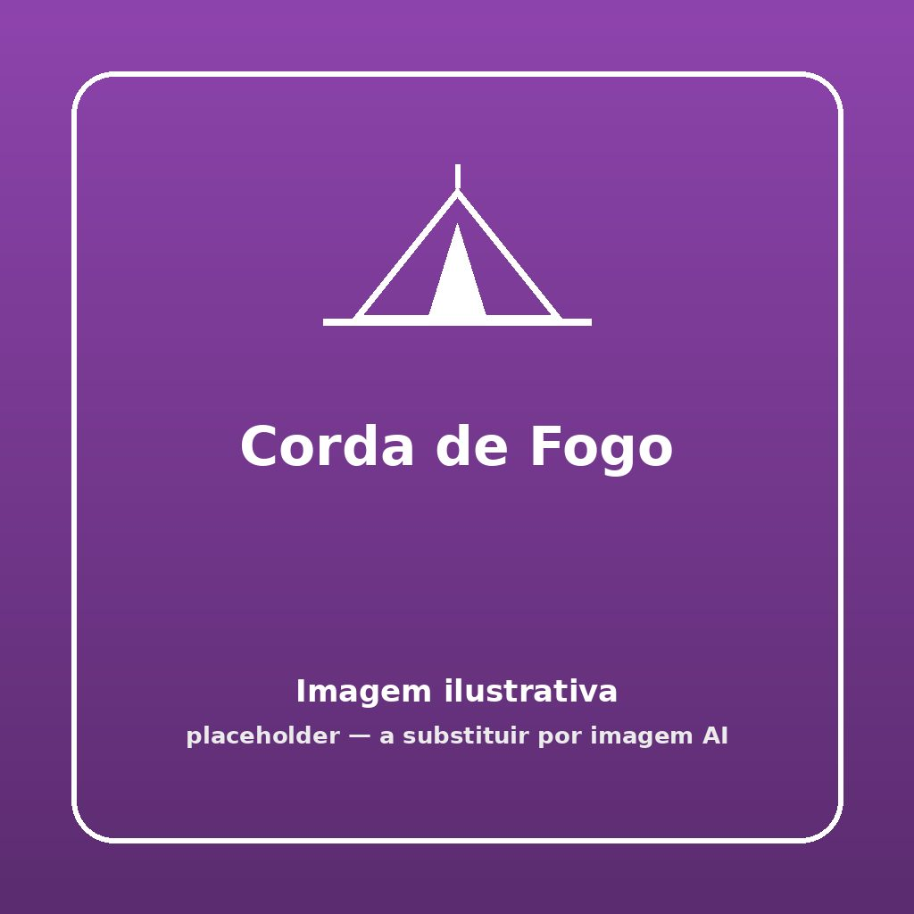


Um clássico jogo frenético de agilidade, reflexos e rins rápidos! Atenção aos tornozelos porque a corda invisível não espera por saltadores distraídos.


## 🎯 Objetivo
Evitar a eliminação! Saltar repetidamente uma corda (com um contrapeso) que roda rente ao chão pelo centro do círculo antes que ela te acerte nas pernas.

## ⏱️ Duração e Participantes
- **Duração:** 10 minutos (Várias rondas muito rápidas).
- **Participantes:** De 5 a 15 elementos num círculo único por roda.

## 🛠️ Material Necessário
- 1 corda com cerca de 3 metros
- 1 garrafa de plástico de 1,5L deitada fora (meia cheia de água para dar inércia sem magoar).

## 📜 Como Jogar

1. **O Molinete:** Amarrar bem firme a garrafa (meia de água) numa das pontas da corda garantindo absolutamente que não se solta com a velocidade centrífuga.
2. **A "Fogueira":** Os jogadores formam uma roda ampla a uma distância equidistante do centro.
3. **Pirotecnia:** O animador/chefe agacha-se bem baixo mesmo no centro do círculo e começa a rodar, deslizando a garrafa deitada em círculos contínuos no chão (10 a 20 cm no máximo de altura), dando velocidade gradual à engrenagem.
4. **Agilidade:** Ao aproximar-se da secção de arco de cada escuteiro, os jogadores devem obrigatoriamente realizar um salto a pés juntos ou abrir as pernas pelo ar e deixar a garrafa de fogo e a corda passarem-lhes sem tocar nelas.
5. **Quem se Queima:** Quem for tocado seja pela corda, seja pela garrafa nos sapatos, sai imediatamente da roda, ficando fora do jogo a apoiar o resto.
6. **Vencedor:** O mestre molinete pode aumentar não só a velocidade como, ocasionalmente, inverter a rotação! Vence o último "sobrevivente" resistente a manter-se no centro da ação.

## 🌟 Dicas de Animação

> [!TIP]
> **Efeitos Sonoros**
> O dirigente no centro pode ir emitindo sons como de hélice de helicóptero acelerando, ou a simular um feixe de lasers para aumentar o teatro. "Quem pisar a garrafa leva a equipa a rebentar!".

## 🛡️ Segurança

> [!WARNING]
> **Peso Correto do Contrapeso**
> Evitar utilizar baldes de areia, pedras presas ou a garrafa demasiado cheia de gelo - se a garrafa embater com as espinhas das canelas a uma velocidade elevada tem de amassar organicamente sem aleijar e sem fazer nódoas negras, preferir também a corda rente ao chao, a bater nos sapatos.

## 🔄 Variantes

### Modo Equipa / Varas de Gelo
Em vez de jogar individualmente numa roda todos por um, as equipas estão separadas em dois semi-círculos. A cada toque que a equipa sofra a roda toda dessa equipa encolhe o raio 10 centímetros, tornando os saltos com cada vez menos tempo de reação. Ganha o semi-círculo que durar fisicamente mais longe.
