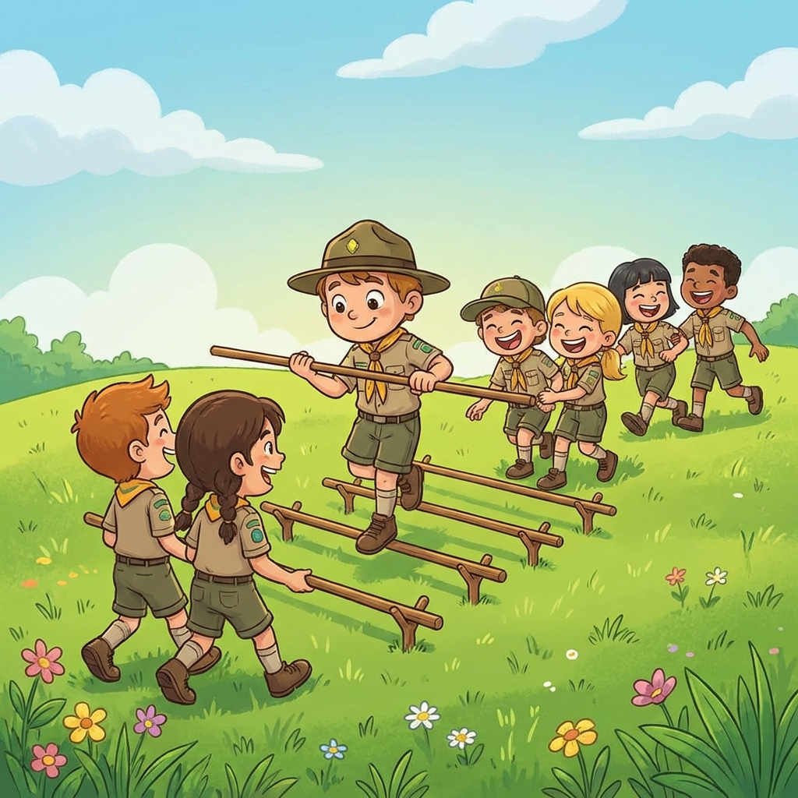


Um desafio tremendo de cooperação cega: construir e segurar uma ponte de degraus infinitos onde um colega tem de caminhar no ar!


## 🎯 Objetivo
Testar o entrosamento e força da equipa: conseguir que o elemento mais leve flutue no ar (pivô) equilibrando-se nos degraus formados pelas varas móveis seguradas fisicamente pelos restantes colegas. 

## ⏱️ Duração e Participantes
- **Duração:** 5 a 10 minutos
- **Participantes:** Ideal para bandos/patrulhas cheias (mínimo de 7 elementos: 1 a andar, 6 a segurar as 3 varas).

## 🛠️ Material Necessário
- Pelo menos 3 a 5 varas de pioneirismo por equipa, bastante resistentes e lisas.

## 📜 Como Jogar

1. **A Escolha:** A equipa elege um elemento para ser o **pivô** voador (preferencialmente alguém leve e com excelente equilíbrio, como o Guia ou um novato destemido).
2. **As Pilastras:** Os restantes elementos formam pares, ficando um de frente para o outro. Cada par apoia entre si nas mãos, bem firmes e na horizontal, uma única vara a meia canela do chão.
3. **Subida aos Céus:** O pivô sobe para as varas. O objetivo é andar de um degrau (vara a vara) do ponto A ao ponto B sem nunca poder pisar no chão.
4. **Motor Orgânico:** Como as varas são curtas e finitas, a equipa tem de se mover! À medida que o pivô avança a passar por cada vara traseira, esse par desoculpa deve correr imediatamente para a frente da fila, criando uma fundação sucessiva da ponte (semelhante ao sistema de lagartas dum tanque).
5. **Vitória:** Vence a equipa que conseguir fazer todo o trajeto exigido sem deixarem o pivô perder o equilíbrio para o chão ou partir e desatar nós pela pressa.

## 🌟 Dicas de Animação

> [!TIP]
> **Alinhamento do Passo**
> O Guia que anda em cima deve dar ordens rítmicas - "Esquerda! Direita! Avança trás!". O par traseiro só levanta se garantir que o pivô não tem de modo nenhum o calcanhar encostado na última vara, senão perde a base de sustentação inferior e desequilibram-se os 3!

## 🛡️ Segurança

> [!WARNING]
> **Altura das Varas**
> A "corrida aérea" não pode ocorrer muito alta, para segurança total das quedas. O joelho ou canela baixa dos seguradores (máximo 40/50 cm do chão) é o ideal. O pivô caminha de bota ou ténis apropriados; as varas e mãos limpas de farpas. O terreno por baixo destas quedas naturais não deve ter cepos de árvores perigosos cortados.

## 🔄 Variantes

### Passos da Lua com Fardos
Substituir as varas fixas de escoria da equipa inteira por apenas uma mão de cada lado se forem mais velhos e usarem pequenas pranchas curtas. Outro método incrível é transportar "Cargas" - baldes cheios de água às costas do pivô onde perder o chão implica entornar a carga preciosa para trás também.
