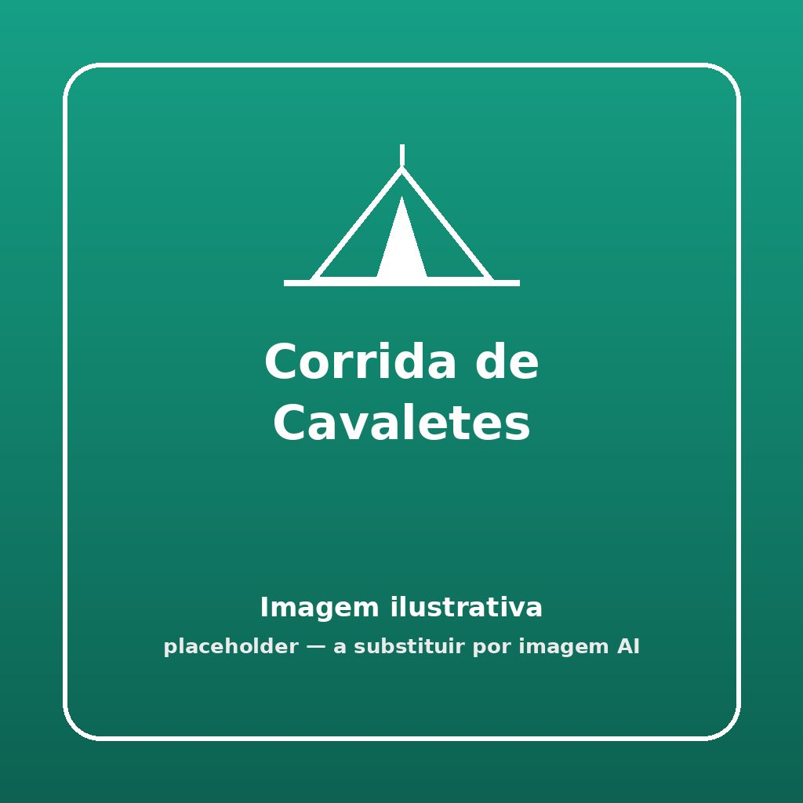


Um autêntico desafio de pioneirismo onde os nós e amarrações são postos à prova com o peso e força da própria equipa. Se for mal atado, a carruagem vai quebrar!


## 🎯 Objetivo
Testar a competência técnica da patrulha executando amarrações perfeitamente justas para construir um cavalete ('A' ou 'H') e, em seguida, efetuar uma corrida carregando um membro em cima sem que a estrutura colapse.

## ⏱️ Duração e Participantes
- **Duração:** 20 a 30 minutos (dependendo do nível técnico)
- **Participantes:** Patrulhas inteiras (mínimo de 4 escuteiros para poderem transportar o cavalete depois de pronto).

## 🛠️ Material Necessário
- Pelo menos 10m de corda ou sisal grosso adequado (por patrulha)
- Pelo menos 6 varas (por patrulha) - O tamanho depende do formato preferido do cavalete (2 pernas mestras longas e varões de travamento menores).

## 📜 Como Jogar

1. **A Construção Pura:** O objetivo primário é desafiar cada equipa a construir o seu próprio cavalete de suporte do zero, usando Amarrações Quadradas, Diagonais e nós tradicionais (Fiel, Direito, Cabeça de Cotovia).
2. **Avaliação Técnica:** Fica à responsabilidade do Chefe validar as amarrações. As cordas não podem estar bambas nem rematadas com laços de sapato!
3. **A Corrida (Teste Resistência):** Após autorização ("O Cavalete está Aprovado!"), 1 elemento da equipa senta-se ou apoia-se firmemente no travessão horizontal do cavalete. 
4. **O Transporte:** Os restantes membros levantam fisicamente a estrutura pesada usando a força de ombros/braços no próprio cavalete, sem segurarem nas pernas da pessoa transportada. 
5. **Critério de Vitória:** A equipa que completar uma ida e volta no percurso de 20 metros sem desmontar/quebrar nenhuma amarração ganha base temporal. Se o cavalete ceder, a equipa pára e tem de amarrar novamente no local do desastre!

## 🌟 Dicas de Animação

> [!TIP]
> **Adiciona Pressão**
> Atribua papéis: O Engenheiro (só pode falar, não põe as mãos), os Operários (amarram) e a Realeza (quem será transportado). Isto força a comunicação de técnica pioneira de quem sabe "Guiar" uma estrutura complexa sem fazer ele mesmo o nó.

## 🛡️ Segurança

> [!WARNING]
> **Elevação e Peso**
> Ao efetuar a corrida, se houver perigo do cavalete ceder, a pessoa transportada não pode ir montada demasiado alto. 50cm-1m é a margem ideal. Realizar em piso liso, sem declives, para que um tropeção dos carregadores não derrube a sua própria arquitetura para a frente.

## 🔄 Variantes

### Carruagem Romana
Em vez de erguer em braços o cavalete do chão com o passageiro até à linha de meta, a equipa constrói-o com varas extra de atrelado frontal, servindo de trenó, e arrastam-no pela terra batida do acampamento enquanto o "Romano" vai montado no "A" guiando as cordas rédeas.
