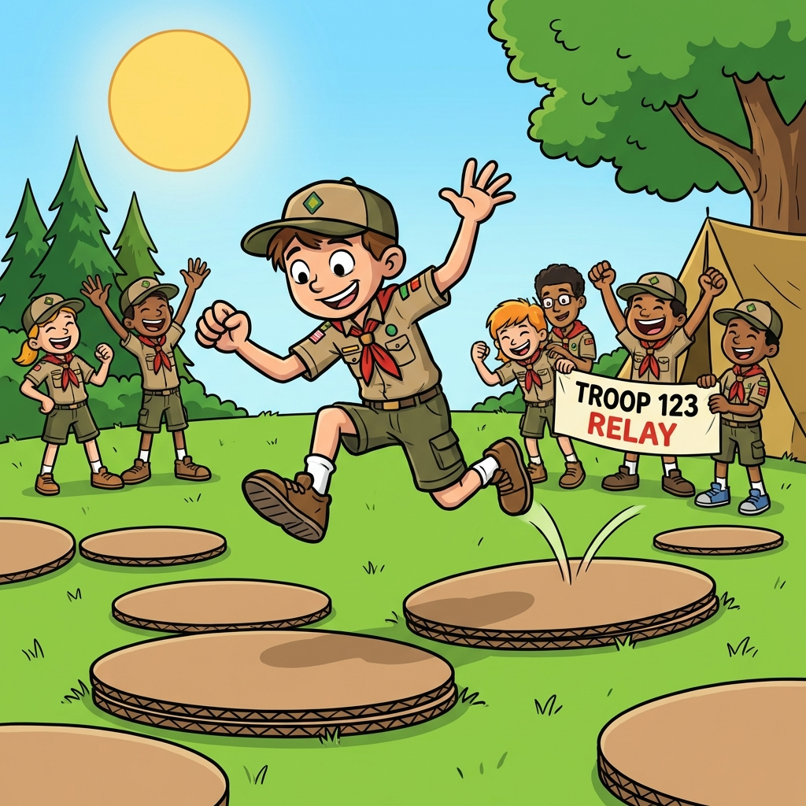

Teste de agilidade onde o chão é lava! Os escuteiros só podem pisar os discos de cartão.

## Material Necessário

- 3 rodelas de cartão grosso por equipa (tipo caixa de pizza ou maior)

## Imagem do Jogo

## Duração
10 minutos

## Desenvolvimento

1. Cada equipa recebe 3 discos de cartão no ponto de partida (A).
2. O objetivo é chegar ao ponto B usando APENAS os discos, na seguinte sequência:
   - Atira o disco 1 e salta com os dois pés para cima dele.
   - Atira os discos 2 e 3 e salta com um pé para cada um.
   - Recolhe o disco 1 (que ficou para trás) e repete o processo.
3. Se tocar com o pé no chão, volta ao início!
4. Chegando ao ponto B, o jogador recolhe os discos e corre para entregar ao próximo elemento da equipa.
5. Ganha a equipa que terminar o percurso com todos os elementos primeiro.
