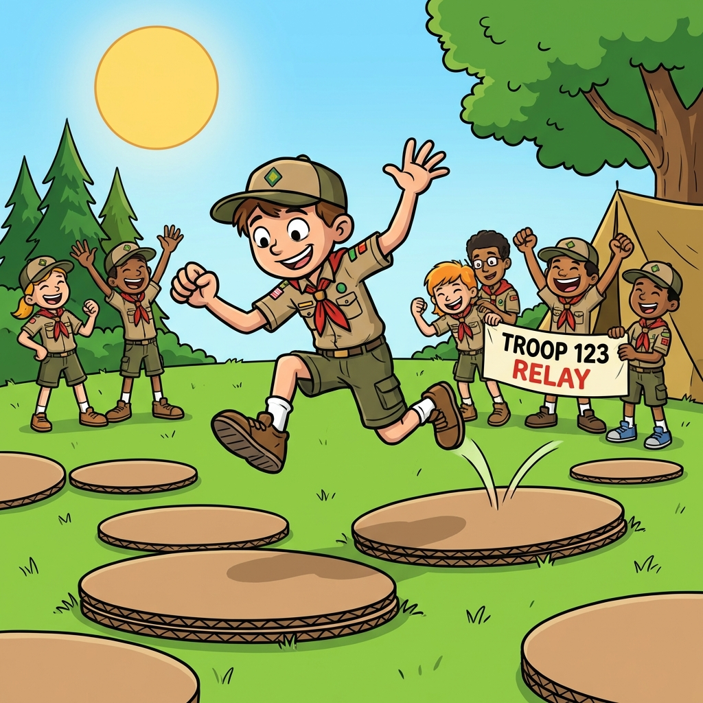


Um autêntico teste de agilidade e planeamento onde o chão é lava! Os escuteiros só podem pisar pequenas ilhas circulares no meio do mar fervente.


## 🎯 Objetivo
Atravessar um corredor sem nunca tocar no chão, usando apenas três pequenos discos de cartão que são constantemente recolhidos de trás e atirados para a frente da progressão.

## ⏱️ Duração e Participantes
- **Duração:** 10 a 15 minutos
- **Participantes:** Ideal para formatos de estafeta entre bandos de Lobitos ou patrulhas pequenas (4 a 6 elementos).

## 🛠️ Material Necessário
- 3 rodelas grossas de cartão canelado por equipa (tamanho de recortes de caixas de pizza).

## 📜 Como Jogar

1. **Ilhas Salva-Vidas:** Cada equipa recebe 3 discos de cartão no ponto de partida (margem do rio, A).
2. **A Travessia:** O primeiro jogador atira o disco N.º 1 e salta com os dois pés aterra firmemente sobre ele.
3. **Perna-Aberta:** O jogador atira seguidamente os discos 2 e 3 um pouco mais afastados, e salta com a perna direita para o disco 2 e a perna esquerda para o disco 3. O jogador fica na posição de esparregata mansa.
4. **Recolha e Avanço:** Sem tirar os pés dos discos dianteiros onde está plantado, dobra-se, retira o disco 1 que ficou para trás vazio e repete o processo, atirando-o para diante.
5. **O Retorno:** Se o escuteiro perder o equilíbrio e tocar com a biqueira da bota que seja no chão/lava, volta imediatamente à linha A para recomeçar!
6. **Passagem de Testemunho:** Chegando à margem oposta (linha B), o jogador recolhe apressadamente as três rodelas, corre pelo exterior de volta ao início e entrega a "tocas" ao parceiro seguinte.

## 🌟 Dicas de Animação

> [!TIP]
> **Adaptação Rápida às Idades**
> Reduzir drasticamente o tamanho dos cartões (discos de cds velhos) e a distância do corredor para Lobitos (maior probabilidade de cair é quando têm de se dobrar para apanhar o de trás). Fazer sons de "Tsss, o chão está a queimar!" quando hesitam.

## 🛡️ Segurança

> [!WARNING]
> **Cartão Assapado**
> Os discos de cartão, ao calcarem em pisos lamacentos ou orvalhados da manhã, ficam moles, muito escorregadios e esfarelam-se. Prepara suplentes ou forra-os com fita-cola larga se estiver humidade, senão arriscam o espagato completo!

## 🔄 Variantes

### Jogo Noturno
Pôr os cartões já estrategicamente dispostos no chão de distâncias cada vez maiores mas usar pedaços com luzes químicas presas (são pedras luminescentes no pantano escuro).
