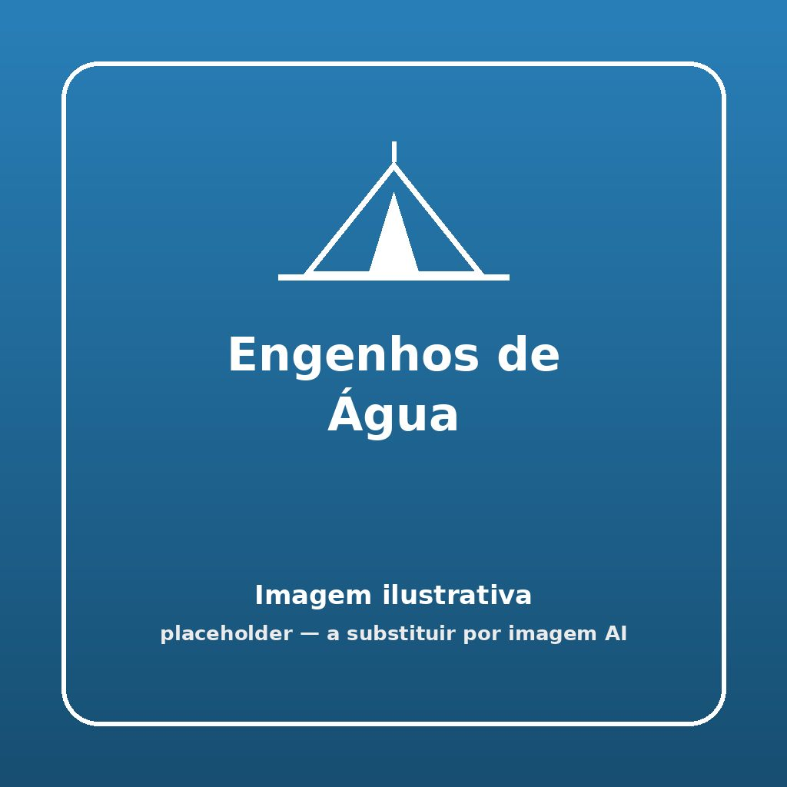


Um jogo refrescante de construção e pontaria utilizando materiais reutilizados, excelente para os dias quentes de acampamento!


## 🎯 Objetivo
Construir uma pistola de água com materiais recicláveis e competir para encher um recipiente à distância com a maior quantidade de água num determinado tempo.

## ⏱️ Duração e Participantes
- **Duração:** 30 minutos
- **Participantes:** Ideal para equipas/bandos/patrulhas de 4 a 6 elementos.

## 🛠️ Material Necessário
- 2+ garrafas de água de 0.5l vazias
- 2+ pontas de garrafas do tipo "lava vidros" (spray pulverizador)
- Cola quente ou fita isoladora
- 2 bacias / recipientes
- Fita métrica
- 1 bidão grande com água
- Corantes alimentares (opcional)

## 📜 Como Jogar

1. **Construção:** Entregar os materiais de construção às equipas e dar-lhes cerca de 10 minutos para construírem as suas "pistolas". Usar a ponta do spray enroscada ou colada à garrafa pequena de água.
2. **Preparação do Local:** Colocar os recipientes a encher a uma distância acordada (por exemplo, 3 metros) das equipas.
3. **Abastecimento:** Cada equipa recolhe água do bidão central para as suas garrafas/depósitos do seu engenho de água. Se disponíveis, deitar umas gotas de corante alimentar na água de cada equipa com cores diferentes para facilitar a medição final e criar um efeito visual dinâmico.
4. **Acção:** Ao sinal do chefe, todos começam a pulverizar/esguichar água para dentro da sua respetiva bacia, procurando não desperdiçar. Podem recarregar a garrafa no bidão as vezes que precisarem.
5. **Vitória:** Ao fim do tempo estabelecido (ex: 5 minutos), mede-se a quantidade de água no recipiente de cada equipa. Ganha a que tiver conseguido encher mais água no recipiente à distância.

## 🌟 Dicas de Animação

> [!TIP]
> **Adiciona um Imaginário Forte**
> Transforma a atividade num imaginário em que os elementos são bombeiros numa formação de combate a incêndios de elite, ou inventores a testar protótipos de irrigação para uma horta seca.

## 🛡️ Segurança

> [!WARNING]
> **Prevenção de Acidentes**
> Ao lidar com água num jogo físico, o piso/terreno ficará muito escorregadio. Define regras claras:
> - Proibido correr com os engenhos cheios na mão.
> - Não apontar os jatos de água à cara ou olhos dos outros jogadores.

## 🔄 Variantes

### Jogo de Estafetas "Cego"
Um elemento da equipa de olhos vendados é o "canhão" e segura o engenho. O resto da equipa serve de "guias de artilharia", dando instruções verbais (escala bombordo/estibordo, mais alto/mais baixo) para que a vendado acerte no alvo / recipiente.

### Construção Livre (Engenharia Pioneira/Caminheira)
Em vez de material padrão, dar apenas tubos soltos, seringas grandes (sem agulha), furos de mangueira, fita adesiva larga, e garrafões. Avaliar a equipa não apenas pelo acerto de jatos, mas pela criatividade estrutural do engenho de pressão montado.
