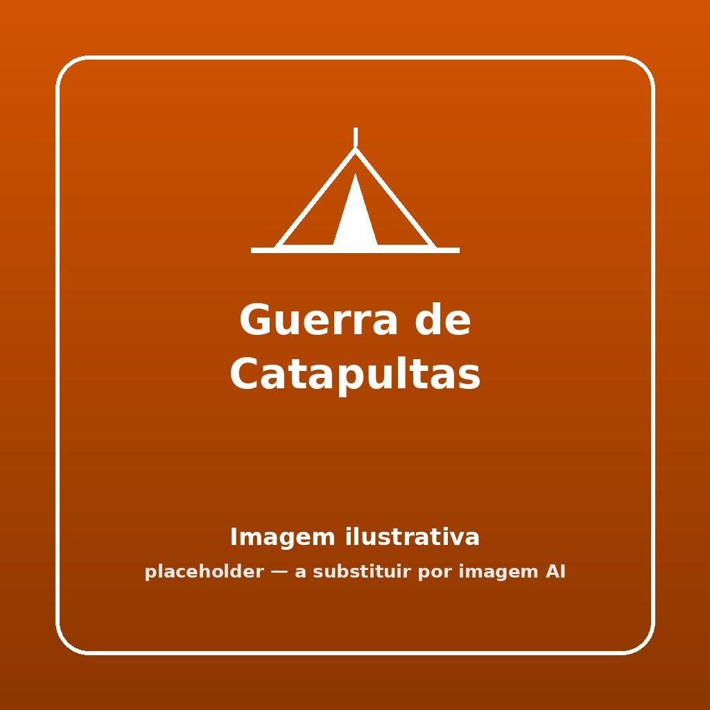


Um desafio de verdadeiro calibre engenheiro escutista onde as tuas técnicas de pioneirismo com as varas se medem em alcance bélico de água colorida!


## 🎯 Objetivo
Habilidade prática avançada onde as equipas têm que erguer catapultas autossustentáveis eficientes, do zero, utilizando cordame escutista para no fim da tarde participarem num torneio de lançamento a longa distância.

## ⏱️ Duração e Participantes
- **Duração:** 60 a 90 minutos (para fase de construção lenta e ensaios balísticos)
- **Participantes:** Dinâmica de Exploradores, Pioneiros ou Caminheiros divididos pelas suas Patrulhas orgânicas.

## 🛠️ Material Necessário
- Bobinas de cisal, cairo fiavel ou baraço
- 8 a 12 varas / bicos por equipa (de 2m ou superiores)
- Câmaras de ar velhas (bicicleta), elásticos tubulares / tensores bungies ou panos para cama da fisga da catapulta.
- Dezenas de balões de água 

## 📜 Como Jogar

1. **Projetos de Arquitetura:** Dar liberdade total ou distribuir rascunhos de base às equipas sobre estruturas de base quadra / piramidal com braço alavanca móvel. Permitir cerca de hora e pouco para planeamento e atar nós apertados perfeitos.
2. **Avaliação Prática:** Findo o tempo dos serrotes de estaleiro, as estruturas construídas devem ir para alinhamento e inspeção pelo Dirigente! Não pode haver amarrações perigosas frouxas sob tensão.
3. **O Torneio Balístico:** Abastecer as colheres / cestos de elásticos destas grandes peças de artilharia rudimentares com munição de balões de água pesados de 1L ou menos. 
4. **Acerto de Distância:** No descampado livre, medir o limite frontal de onde foi projetado o balão até à mancha no chão onde a água perfurou. Ganha a catapulta que tiver alavanca forte suficiente com ângulo preciso de balanço para bater os metros dos adversários (alcance puro).
5. **Decisões Empatadas:** Havendo distâncias exatas, a vistoria do mestre de campo decide pela perfeição da simetria triangular ou pela tensão excelente do nó de ancoragem principal do braço.

## 🌟 Dicas de Animação

> [!TIP]
> **Catapultas Temáticas**
> Convencê-los a batizar os seus engenhos nobres medievais ("O Trovão do Oeste", "A Rachadora de Baterias") e decorá-las e camuflá-las com fitas/ramos da floresta antes do juiz ver o aspeto intimidatório e dar pontos surpresas extra por bravura estética.

## 🛡️ Segurança

> [!WARNING]
> **Zonas de Perigos Lógicos de Ricochete**
> Com varas de 2 metros impulsionadas violentamente elásticos tensores a fazer o "swing" e retorno, NUNCA ninguém pode permanecer à frente da trajetória imediata de tiro ou mesmo em cima! E ao "armar" as catapultas puxando abaixo, têm de ser coordenados pelo menos 3 membros seguros ao calcar/apoiar peso na base oposta do cavalete para que toda a montagem não faça uma cambalhota tombada em cima das próprias cabeças.

## 🔄 Variantes

### Afundar a Armada com Artilharia de Calibre 
Em vez da marcação em distância infinita bruta de alcance final, dispor 3 panelonas grandes com círculos brancos desenhados a variadas distâncias (10m, 15m e 20m de tiro tenso). Um acerto numa, vale muito mais num tiro milimétrico certeiro em arco (precisão em parabólica) do que ter apenas pujança de força nos braços das fisgas!
