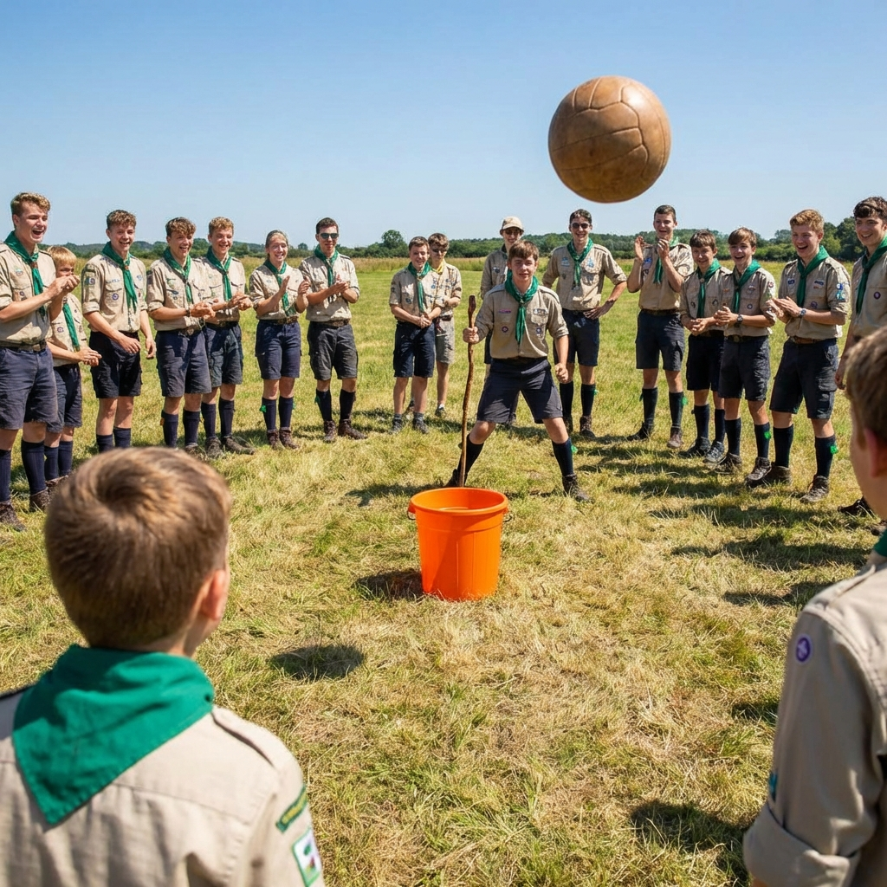

Jogo dinâmico e divertido onde os participantes formam um círculo e tentam acertar numa bola num balde central, enquanto um defensor protege o balde com uma vara.

### Material Necessário

- 1 balde resistente (tipo balde de 20 litros)
- 1 vara / bastão
- 1 bola grande de borracha (tipo bola de recreio)

### Como Jogar

- Coloca o balde no centro de um espaço amplo (interior ou exterior)
- Os elementos formam um círculo grande à volta do balde
- Um elemento sobe para cima do balde e segura a vara em posição de defesa
- O jogo:
   - A bola é passada entre os elementos do círculo
   - Qualquer elemento pode atirar a bola ao balde a qualquer momento;
   - O defensor usa a vara para bloquear os lançamentos
- Se alguém acertar no balde, troca de lugar com o defensor.

### Variações

- **Modo rápido**: Tempo limite de 2 minutos por defensor;
- **Duplo desafio**: Dois baldes e dois defensores;
- **Nível avançado**: Defender com os olhos vendados (apenas para mais velhos)

### Dicas de Segurança
- Usar uma bola macia para evitar lesões;
- Certificar que o balde é estável e resistente;
- Manter distância segura do círculo (mínimo 3 metros de raio);
- Supervisão recomendada para elementos mais novos.

### Vídeo Demonstrativo


