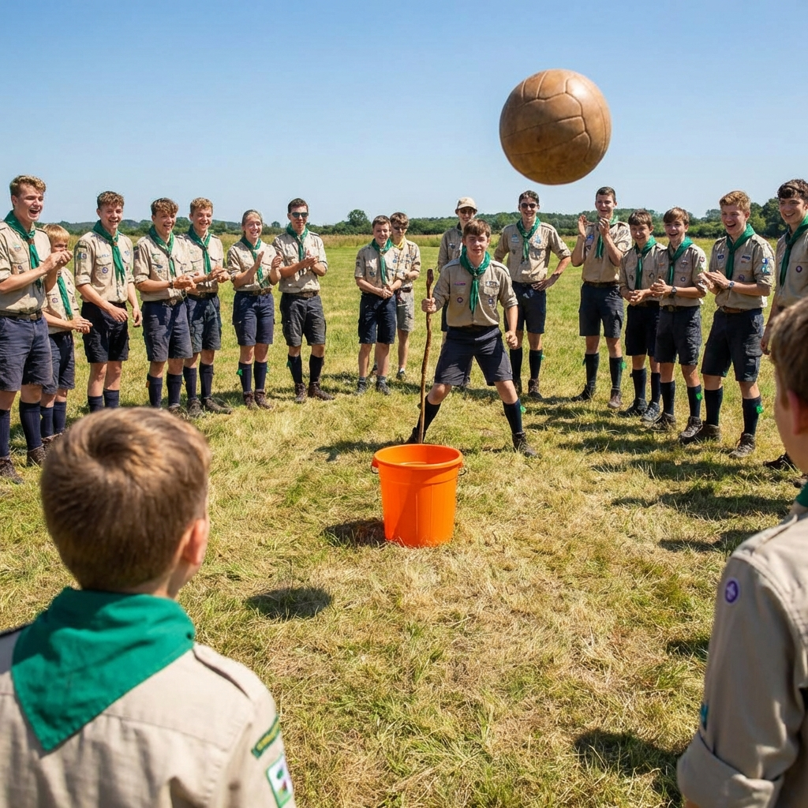


Jogo dinâmico e frenético de grande roda onde o objetivo do grupo é deitar abaixo um balde central, mas o guarda armado fará de tudo para bloquear o tiro!


## 🎯 Objetivo
Habilidade de passe e visão periférica onde os escuteiros tentam acertar com a bola no balde central a partir de qualquer direção, enquanto o escuteiro "Defensor" no meio o protege com a vara.

## ⏱️ Duração e Participantes
- **Duração:** 15 a 20 minutos
- **Participantes:** Excelente para quebra-gelos de secção inteira ou agrupamento (10 a 30 elementos na mesma roda).

## 🛠️ Material Necessário
- 1 balde resistente (tipo balde de tintas vazio de 20 litros ou balde virado ao contrário)
- 1 vara de pioneirismo ou bastão escutista curto
- 1 bola grande de borracha ou vólei macia (tipo bola de recreio escolar)

## 📜 Como Jogar

1. **A Arena:** Coloca-se o balde virado para baixo no centro de um espaço amplo, perfeitamente plano (interior de salão ou terreiro). Os elementos formam um grande círculo muito esticado à volta do balde (mínimo 3 metros de raio de distância).
2. **O Guarda:** Um escuteiro voluntaria-se para o meio, subindo para cima do balde de plástico forte, e segura verticalmente a vara em posição de defesa passiva (como um guarda real).
3. **Passe Rápido:** A bola começa num ponto aleatório do círculo. Os elementos da roda podem lançá-la diretamente e tentar acertar no balde protegido, mas a forma mais inteligente é passarem rapidamente e imprevisivelmente a bola entre eles pela roda fora para confundir a direção de onde sairá o ataque.
4. **O Lançamento:** Qualquer pessoa na roda, quando tiver a posse, pode fazer um lançamento rápido rasteiro ou a meia altura para atingir o balde (não o guarda).
5. **A Defesa:** O guarda central gira rapidamente na sua base, estica o braço, avança e usa apenas a vara / bastão rígido para intercetar o arremesso no ar e rebater a bola para fora!
6. **Troca:** Se alguém conseguir fintar o bloqueio do guarda e acertar ruidosamente no balde de plástico, quem atirou ganha o direito (ou penalização!) de ser o novo guarda lá no meio, trocando de lugar com o anterior.

## 🌟 Dicas de Animação

> [!TIP]
> **Fake-Passes**
> Relembra os jogadores que se atirarem sempre diretamente nunca vão furar a defesa. Enganar com o olhar ou simular que vão atirar para um lado obrigando o guarda a virar as costas num nanosegundo para se defender é a chave do ataque surpresa.

## 🛡️ Segurança

> [!WARNING]
> **Golpes Acidentais com o Bastão**
> O balde escolhido tem de aguentar o peso corporal para não colapsar durante piruetas lá em cima. Ao rebater, nunca podem usar as varas como tacos de basebol numa pancada tipo "Home-Run". O papel da vara é escudo morto (intercetador vertical), sem balanço agressivo para perigo de ir parar às cabeças e dentes do círculo ou devolver a bola violentamente contra a cara de um lobito! Usar bola macia, nunca de futsal ou de couro rijo.

## 🔄 Variantes

### Cerco ao Castelo Duplo (Defesa Épica)
Para rodas de agrupamento gigantes com mais de 30 elementos: colocar Dois baldes, Um ao lado do outro, e Dois defensores costas-com-costas armados, a circularem entre si para defenderem o cerco contra duas bolas simultâneas que andam na roda inimiga. O caos duplica!

### Vídeo Demonstrativo

