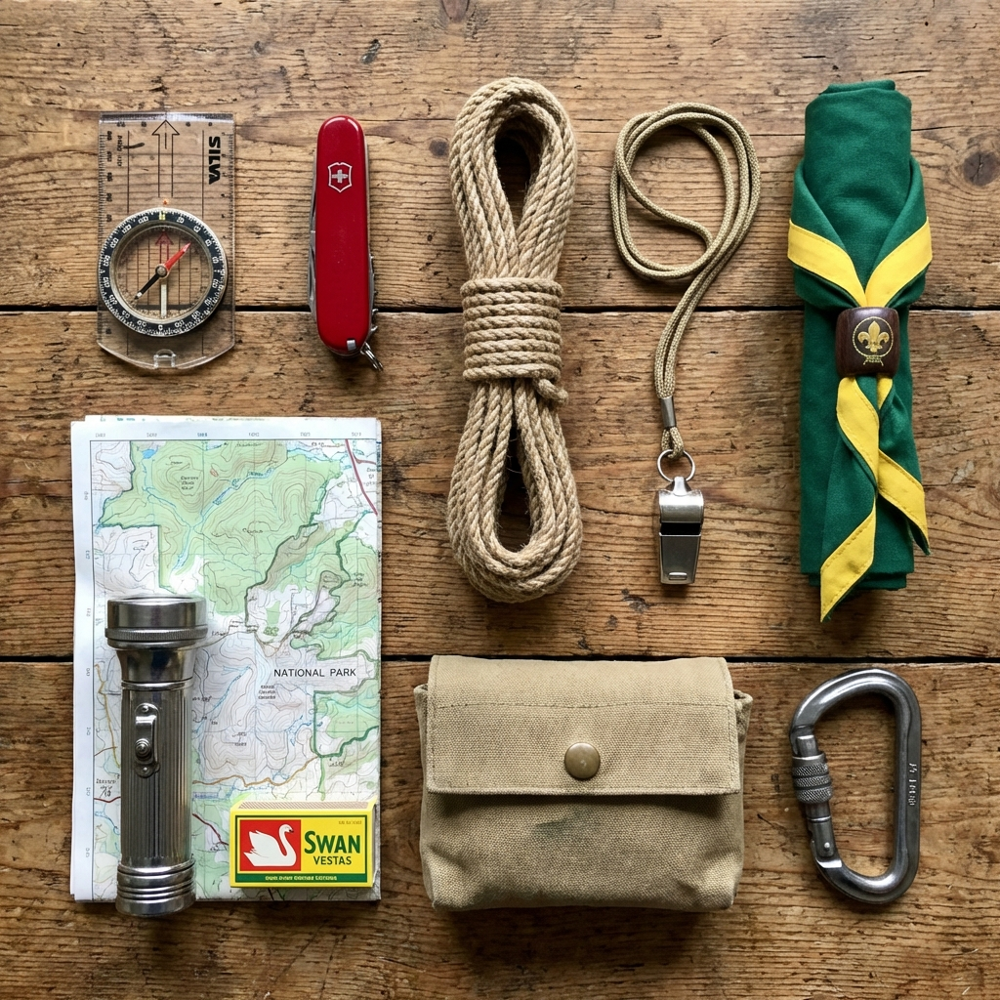


Um dos testes escutistas mais famosos do mundo criado por Baden-Powell para treinar exploradores na arte da observação e memória fotográfica.


## 🎯 Objetivo
Testar a capacidade de memorização a curto prazo, exigindo que os participantes se recordem do máximo número exato de dezenas de objetos aleatórios após uma breve visualização.

## ⏱️ Duração e Participantes
- **Duração:** 10 a 15 minutos
- **Participantes:** Qualquer número de participantes, podendo jogar individualmente ou em sistema cooperativo de bando/patrulha.

## 🛠️ Material Necessário
- 15 a 30 objetos extremamente variados (bússola, pinha, isqueiro, meia, clipe, etc)
- 1 pano opaco tricotado, manta ou oleado grande
- Folhas de papel e canetas (1 conjunto por equipa ou individuo)
- Relógio ou cronómetro

## 📜 Como Jogar

1. **Os Preparativos Escondidos:** Longe da vista dos miúdos, o Chefe arranja a dezena de objetos variadíssimos do dia-a-dia de forma organizada mas aleatória numa mesa ou tela no chão. Cobre tudo meticulosamente com a manta.
2. **A Exigência Visual:** O grupo aproxima-se e rodeia a lona. O pano é levantado simultaneamente para todos e começa a contagem de rigorosos 60 Segundos (1 minuto).
3. **Observação Silenciosa:** Durante o minuto de exposição, ninguém pode falar nem apontar num papel! Os escuteiros apenas cruzam os braços e têm de decorar os itens mentalmente usando técnicas de associação de memória.
4. **O Eclipse:** Fim do tempo, a manta volta a cobrir os objetos de repente.
5. **Apontar Febrilmente:** Assim que o pano cai, as equipas/jogadores recebem autorização para pegar no papel e esgravatar em 2 ou 3 minutos a listagem de todos os objetos e detalhes que se recordam.
6. **Contagem e Cotação:** Lê-se a lista em voz alta. Cada objeto certo vale 1 ponto. Se referirem algo que nunca esteve na mesa perdem 1 ponto! Ganha o indivíduo/equipa com melhor memória fotográfica total.

## 🌟 Dicas de Animação

> [!TIP]
> **Palácios da Memória**
> Ensine a técnica ancestral mnemónica de encadear uma história entre as coisas. Exemplo: "O (Boneco) calçou a (Bota) pegou na (Faca) e cortou a (Corda) da (Tenda)". Em vez de decorar itens aleatórios separadamente decoram uma curta história louca.

## 🛡️ Segurança

> [!WARNING]
> **Trapaceiros à Vista**
> Para evitar espreitadelas laterais de escuteiros por debaixo do pano após o tempo limite, feche as abas dos lados ou mude a mesa para uma sala completamente vazia onde eles entram 1 minuto e recuam para a rua a seguir.

## 🔄 Variantes

### O Tlato (Kim Táctil Noturno)  
Não há visão. Num saco grosso do lixo de plástico ou Fronha de Almofada, mergulham-se os itens. Cada candidato mete lá as mãos cegas durante 30 segs tentando apalpar formas, texturas e dentes para adivinhar a lista secreta que esteve a manusear.

## Recursos Externos
Para mais ideias de jogos de memória, consulta [📄 Escutismo.pt](https://escutismo.pt)