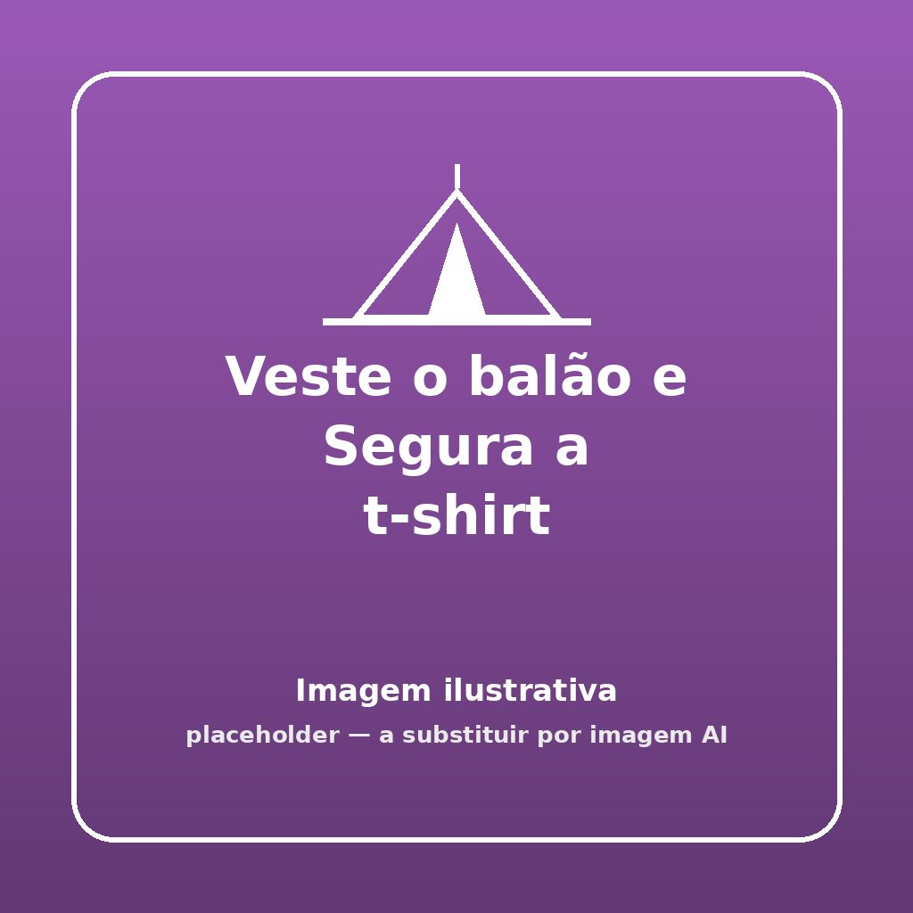


Será que consegues a agilidade cerebral e manual frenética de te conseguires vestir perfeitamente, e fechar uma camisola apertada, enquanto ao mesmo tempo impedes um balão de gravidade zero de tocar o chão com pequenos toques da tua própria cabeça?


## 🎯 Objetivo
Desafio hilariante de destreza motora rápida onde os indivíduos de lombo despido tentam enfiar e vestir uma t-shirt larga simultaneamente enquanto mantêm um balão sempre no ar, sem permissão para o agarrar fisicamente pelas mãos ou fixá-lo entre queixos.

## ⏱️ Duração e Participantes
- **Duração:** 10 minutos
- **Participantes:** Jogado idealmente em duelo de representantes de equipa ou numa roda pequena cómica.

## 🛠️ Material Necessário
- 1 T-shirt muito larga XXL (roupa velha de dirigente para facilitar ou roupa ridícula florida) por equipa
- 1 ou mais balões insuflados do tamanho clássico

## 📜 Como Jogar

1. **A Arena:** Estender as camisolas no chão do recreio a cinco metros da equipa e emparelhar com o balão pousado livremente junto do estojo.
2. **A Preparação:** Cada bando/equipa aponta um dos seus representantes mais elásticos (e destemido visualmente) para encabeçar o grande duelo frontal de ginástica ao ridículo.
3. **Primeiros Toques:** Ao sinal sonoro de partida, os representantes arrancam na corrida até aos adereços, dando palmadinhas ao balão enviando-o livre para os ares. Toca a lançar para o balanço.
4. **Sem Abraços Mágicos:** Imediatamente, sem prender ou guardar o balão contra ele abraçado a o encavar no peito em esparadrapo, ele agarra a camisola por baixo de de braço do chão com as suas mãos. Ele não pode segurar o balão com as mãos nisto tudo - apenas usar as costas da mão, a testa de cabeçada, os joelhos e cotovelos aos tranbolhões pelo ar, para o esmurrar a recartal e mante-lo longe de se esmagar da gravidade.
5. **A Carga Roupeira:** A meio das cambalhotas, a cabeça e duas mangas da longa camisa têm de ser enfiadas integralmente - t-shirt no sítio. A equipa na base delira a puxar o escuteiro pelos bicos. 
6. **Vencedor Absoluto:** Só conta e vencerá aquele campeão que se mostrar vestido imaculado primeiro, cantando hino da sua secção, e com o balão no final ainda saltitante no topo por cima de si em dança vitoriosa!

## 🌟 Dicas de Animação

> [!TIP]
> **Camisolas do Patetismo**
> Traga do baú fardas hiper complicadas ou adereços esquisitos de palhaço, que exijam enganos por onde se deve colocar a orelha. Os elementos da assistência devem aplaudir como focas a cada cabeçada bem gizada!

## 🛡️ Segurança

> [!WARNING]
> **Danos e Tropeções no Foco**
> Quando se olha para as nuvens de forma extasiada esquecem os desníveis com as pernas aos pinos, o instinto animal reage saltar as barreiras perigosas para alcançar o balão do vento, deve realizar numa área isenta total de poças secas afiadas, mesas de canto mortais de esquina dos centros para que no frenesim não acorram os dentes partidos.

## 🔄 Variantes

### Inversão Climática
O jogo para os Pioneiros não veste só T-shirt e sim Veste (T-shirt), calça (Meias de Natal longas), põe Cachecol longo e remata o Chapéu à Cavaleiro com uma enorme e penadas a esvoaçar sempre no ar do ar com as palmas sem o balão caír, até ficarem no meio de Julho cheios como pinguins.
